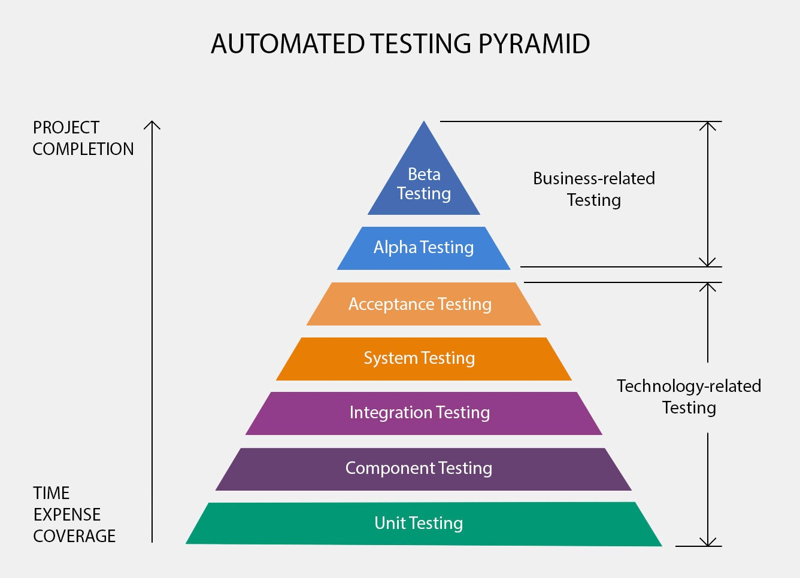

= Spring Testing
ifdef::env-github[]
:tip-caption: :bulb:
:note-caption: :information_source:
:important-caption: :heavy_exclamation_mark:
:caution-caption: :fire:
:warning-caption: :warning:
endif::[]
:icons: font
:toc: left
:toclevels: 4
:toc-title: Table of Contents

== Type of tests by layers

=== The layers of automated testing pyramid

https://medium.com/@SphereSoftware/achieving-quality-code-and-roi-through-test-automation-db60f3f7f24a[link to article]

.automated testing pyramid
[#img-sunset]
[caption="Figure 1: ",link=https://miro.medium.com/max/1336/1*KP4gROJW3edatj0aVnTlpA.jpeg]

=== Automated testing takes place on several levels of the project:

. *Unit testing:* Usually performed by developers, the main goal of these tests is to make sure that the app’s components match in terms of functional requirements.
For example, a unit test could involve an OOP class or function.
. *Component testing:* Usually performed by developers, the “component” being tested is a part of the high-coupled logic.
For example, authorization, payment processing, and order submission could all be components.
. *Integration testing:* Usually performed by developers and QA, the goal of these tests is to make sure the app’s components all interact properly.
. *System testing:* Performed by QA, these tests check that the application and the system are compatible.
. *Acceptance testing:* Performed by QA, these tests are done to ensure that the specification requirements are met.
. *Alpha testing:* Performed by development and user experience teams, these tests are done at the end of the development process.
. *Beta testing:* Performed by user experience teams, these tests are done just before the product is launched.

== Layers

=== 1. Integration Tests

REST API tests, controllers tests, testing integration with other services by using MOCKS or Stubs

. Testing could be done with:
.. TestRestTemplate
.. REST Assured
. Spring Boot example Configuration
.. normally it needs to spin up a full Spring boot Application context or context with tested controller and dependencies for it
.. slow tests

.Examples of using
[source,java]
----
@ExtendWith(SpringExtension.class) // @RunWith(SpringRunner.class) for Junit 4
@SpringBootTest(webEnvironment = WebEnvironment.RANDOM_PORT)
class MyControllerIntegrationTest {

    @Autowired
    private TestRestTemplate testRestTemplate;

    @Test
    void getExistedEntity_OK() {
        ResponseEntity<String> response = testRestTemplate.getForEntity(baseUrl + "/id/1", String.class);
        assertThat(response.getStatusCode(), equalTo(HttpStatus.OK));
    }
}
----

.Examples with Rest Assured
[source,java]
----
@Test
public void givenUrl_whenJsonResponseHasArrayWithGivenValuesUnderKey_thenCorrect() {
    get("/events?id=390")
        .then()
    .assertThat()
      .body("odds.price", hasItems("1.30", "5.25"));
}
----

=== 2. Middle Layer Tests

it like integration but a bit low layer without do a real http call

. Testing could be done with:
.. Spring MockMVC
. Spring Boot example Configuration ..
.. much faster

.Examples of using
[source,java]
----
@ExtendWith(SpringExtension.class) // @RunWith(SpringRunner.class) for Junit 4
@WebMvcTest(EmployeeRESTController.class)
class TestEmployeeRESTController {

    @Autowired
    private MockMvc mvc;

    @Test
    public void getAllEmployeesAPI(){
      mvc.perform(get("/employees").accept(MediaType.APPLICATION_JSON))
          .andDo(print())
    //    other assertions
          .andExpect(status().isOk());
  }
}
----

.Other variant
[source,java]
----
@WebMvcTest(EmployeeRestController.class)
public class EmployeeRestControllerIntegrationTest {

    @Autowired
    private MockMvc mvc;

    @MockBean
    private EmployeeService service;

    // write test cases here
}
----

=== 3. Unit Tests

Classical unit tests.
It focuses on single component or method in class and mocks all dependencies this component interacts with

. Description
.. unit tests run in isolation

.Example of the tests
[source,java]
----
@ExtendWith(MockitoExtension.class) // @RunWith(MockitoJUnitRunner.class) for Junit 4
@DisplayName("Spring boot 2 mockito2 Junit5 example")
public class ShowServiceTests {
    private static final String MOCK_OUTPUT = "Mocked show label";
    @Mock
    private TextService textService;
    @InjectMocks
    private ShowService showService;
    @BeforeEach
    void setMockOutput() {
         when(textService.getText()).thenReturn(MOCK_OUTPUT);
    }
    @Test
    @DisplayName("Mock the output of the text service using mockito")
    public void contextLoads() {
        assertEquals(showService.getShowLable(), MOCK_OUTPUT);
    }
}
----

== Documentations

.Link to official Docs
. https://docs.spring.io/spring-framework/docs/current/spring-framework-reference/testing.html[Spring 5 Testing]
. https://docs.spring.io/spring-boot/docs/2.1.5.RELEASE/reference/html/boot-features-testing.html[Spring Boot 2 Testing]

